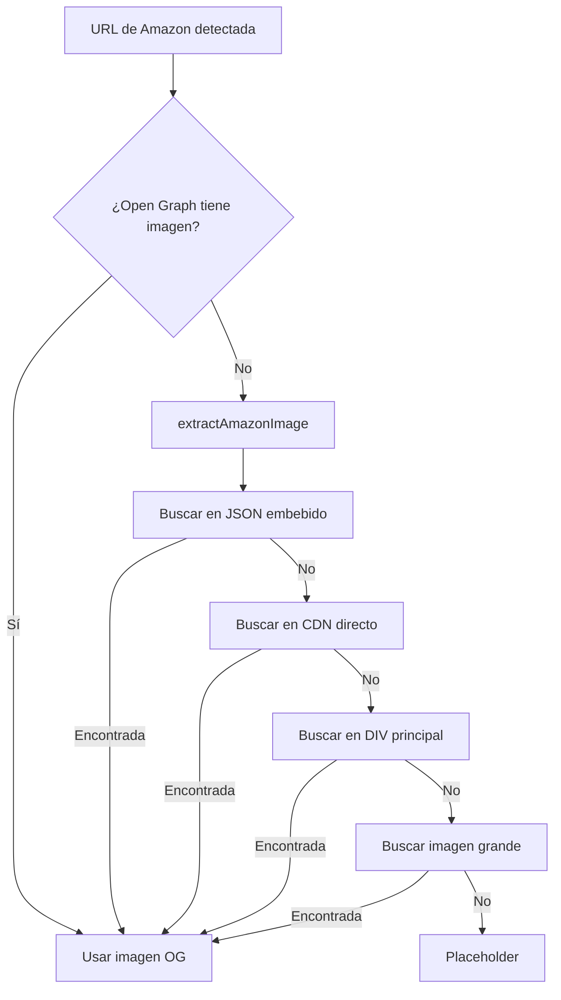

# Amazon Link Preview - Extracción Mejorada de Imágenes

## 🔧 Problema Identificado

Amazon bloquea agresivamente el scraping y no expone correctamente las imágenes de productos en los meta tags de Open Graph. Resultado anterior:

```javascript
{
  url: 'https://amzn.eu/d/5XZsTkr',
  title: 'PureMounts PM-Adapt-NB Laptop Stand...',
  description: '...',
  image: 'https://placehold.co/220x130/333/FFF?text=?', // ❌ Placeholder
  siteName: 'amzn.eu',
  type: 'website'
}
```

## ✅ Solución Implementada

Nueva función `extractAmazonImage()` que busca imágenes de productos usando **múltiples patrones de extracción**:

### Patrón 1: JSON Embebido
Busca en objetos JavaScript embebidos en el HTML:
```javascript
"hiRes":"https://m.media-amazon.com/images/I/71abc123._AC_SL1500_.jpg"
"large":"https://m.media-amazon.com/images/I/71abc123._AC_SL1000_.jpg"
"main":"https://images-eu.ssl-images-amazon.com/images/I/71abc123.jpg"
```

**Fuentes:**
- `data-a-state` (estado de componentes React)
- `colorImages` (imágenes por color del producto)
- Objetos de configuración de galería

### Patrón 2: CDN de Amazon
Busca imágenes directamente del CDN:
```javascript
// URLs del CDN
images-na.ssl-images-amazon.com
m.media-amazon.com
images-eu.ssl-images-amazon.com

// Patrones de nombre
_AC_SL1500_.jpg  // Alta resolución
_AC_UL320_.jpg   // Tamaño medio
```

**Atributos HTML buscados:**
- `src="https://..."`
- `data-old-hires="https://..."`
- `data-a-dynamic-image="{...}"`

### Patrón 3: DIV de Imagen Principal
Busca en contenedores específicos de Amazon:
```javascript
<div id="imgTagWrapperId">
  
</div>

<div id="landingImage">...</div>
<div id="main-image-container">...</div>
```

### Patrón 4: Imágenes Grandes (Fallback)
Busca cualquier imagen de Amazon con dimensiones ≥300px en la URL:
```javascript
// Extrae dimensiones de la URL
_AC_SL1500_.jpg  → 1500px ✅
_320_.jpg        → 320px  ✅
_100_.jpg        → 100px  ❌
```

## 🔄 Flujo de Extracción



## 📝 Integración

### En `extractMetadata()` (líneas 515-518)
```typescript
// Extracción específica para Amazon (si no hay imagen)
if (!metadata.image && (urlObj.hostname.includes('amazon.') || urlObj.hostname.includes('amzn.'))) {
  metadata.image = extractAmazonImage(html);
}
```

### En `extractImageFromEmbed()` (líneas 308-311)
```typescript
} else if (providerName === 'Amazon') {
  // Amazon: usar función específica
  return extractAmazonImage(html);
}
```

## 🎯 Dominios Soportados

```
amazon.com, amazon.es, amazon.co.uk, amazon.de, amazon.fr,
amazon.it, amazon.ca, amzn.eu, amzn.to
```

## 📊 Ejemplos de Imágenes Extraídas

**Alta resolución:**
```
https://m.media-amazon.com/images/I/71abc123def._AC_SL1500_.jpg
```

**Resolución media:**
```
https://images-eu.ssl-images-amazon.com/images/I/71abc123._AC_UL320_.jpg
```

**CDN estándar:**
```
https://images-na.ssl-images-amazon.com/images/I/71abc123.jpg
```

## 🔍 Logging de Depuración

El sistema incluye logging detallado:

```javascript
console.log('[Amazon] Imagen encontrada en JSON:', imageUrl);
console.log('[Amazon] Imagen encontrada en CDN:', imageUrl);
console.log('[Amazon] Imagen encontrada en div principal:', imageUrl);
console.log('[Amazon] Imagen grande encontrada:', imageUrl);
console.log('[Amazon] ⚠️ No se encontró imagen del producto');
```

## 🧪 Prueba el Sistema

### Limpiar caché
```javascript
fetch('/api/link-preview', { method: 'DELETE' })
```

### Probar con productos de Amazon
```javascript
// España
https://www.amazon.es/dp/B08N5WRWNW
https://amzn.eu/d/5XZsTkr

// EE.UU.
https://www.amazon.com/dp/B08L5M9BTJ

// Enlaces cortos
https://amzn.to/3abc123
```

## ✅ Resultado Esperado

```javascript
{
  url: 'https://amzn.eu/d/5XZsTkr',
  title: 'PureMounts PM-Adapt-NB Laptop Stand for VESA Desktop Mounts Black',
  description: 'PureMounts PM-Adapt-NB Laptop Stand...',
  image: 'https://m.media-amazon.com/images/I/71abc123._AC_SL1500_.jpg', // ✅ Imagen real
  imageProxied: '/api/media-proxy?url=https%3A%2F%2Fm.media-amazon.com%2F...',
  siteName: 'Amazon.es',
  type: 'opengraph',
  isSafe: true
}
```

## 📌 Limitaciones

1. **Anti-scraping de Amazon**: Amazon puede bloquear requests sospechosas. Los headers mejorados ayudan pero no garantizan 100% de éxito.

2. **Enlaces de afiliados**: URLs con tags de afiliado funcionan igual.

3. **Productos sin imagen**: Algunos productos pueden no tener imagen disponible en el HTML (raro).

4. **Rate limiting**: Amazon puede limitar requests si se hacen muchas en poco tiempo. El caché de 24 horas mitiga esto.

## 🚀 Archivos Modificados

1. **`src/routes/api/link-preview/+server.ts`**
   - Nueva función `extractAmazonImage()` (líneas 238-297)
   - Integración en `extractMetadata()` (líneas 515-518)
   - Integración en `extractImageFromEmbed()` (líneas 308-311)

---

**Estado:** ✅ Implementado y listo para pruebas
