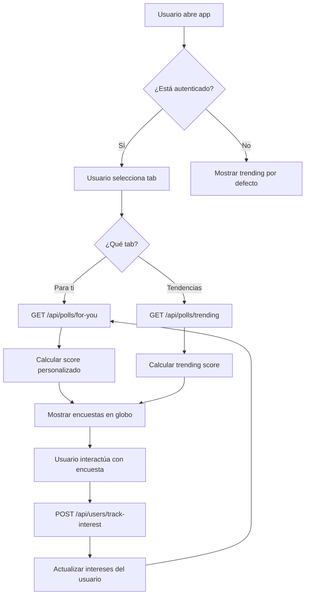

# 🚀 Guía Rápida: Sistema "Para ti" vs "Tendencias"

## ✅ Pasos para Implementar

### 1. **Actualizar Base de Datos**

```bash
# Aplicar migración del schema
npx prisma migrate dev --name add_recommendation_system

# Regenerar cliente Prisma
npx prisma generate
```

### 2. **Crear Usuario de Prueba** (Opcional)

```bash
# Ejecutar script de seed
npx tsx scripts/seed-test-user-with-interests.ts
```

Esto creará:
- ✅ Usuario `testuser` con email `testuser@votetok.com`
- ✅ 5 intereses en diferentes categorías
- ✅ 5 hashtags seguidos
- ✅ 1 usuario seguido

### 3. **Configurar Usuario en el Frontend**

En tu archivo principal (`+page.svelte` o `+layout.svelte`):

```typescript
import { onMount } from 'svelte';
import { setCurrentUser } from '$lib/stores';

onMount(() => {
  // OPCIÓN A: Usuario de prueba (hardcoded)
  setCurrentUser({
    id: 1, // Usar el ID del usuario creado
    username: 'testuser',
    displayName: 'Usuario de Prueba',
    email: 'testuser@votetok.com',
    avatarUrl: 'https://i.pravatar.cc/150?u=testuser',
    verified: false,
    countryIso3: 'ESP',
    subdivisionId: '1',
    role: 'user'
  });

  // OPCIÓN B: Cargar desde tu sistema de autenticación
  // const user = await fetch('/api/auth/me').then(r => r.json());
  // setCurrentUser(user);
});
```

### 4. **Probar el Sistema**

#### En el Navegador:

1. **Abrir la aplicación**
2. **Verificar que el usuario está logueado:**
   ```javascript
   // En consola del navegador
   import { currentUser } from '$lib/stores';
   console.log($currentUser); // Debe mostrar los datos del usuario
   ```

3. **Cambiar entre tabs:**
   - Hacer clic en **"Para ti"** → Debe cargar recomendaciones personalizadas
   - Hacer clic en **"Tendencias"** → Debe cargar trending global
   - Ver mensajes en consola con emojis 🎯🌍

#### Probar APIs Directamente:

```bash
# API de recomendaciones personalizadas
curl "http://localhost:5173/api/polls/for-you?userId=1&limit=5"

# API de trending global
curl "http://localhost:5173/api/polls/trending?limit=5"

# Trackear una interacción
curl -X POST "http://localhost:5173/api/users/track-interest" \
  -H "Content-Type: application/json" \
  -d '{"userId":1,"pollId":1,"interactionType":"vote"}'
```

### 5. **Ver los Logs**

Abre la consola del navegador para ver los logs:

```
[GlobeGL] 🎯 Cargando recomendaciones personalizadas para usuario: testuser
[GlobeGL] 🔄 Cambiando tab a: Tendencias
[GlobeGL] 🌍 Cargando encuestas trending globales
```

---

## 📊 Flujo de Trabajo



---

## 🧪 Casos de Prueba

### Test 1: Usuario Autenticado - "Para ti"
**Pasos:**
1. Setear usuario con `setCurrentUser()`
2. Seleccionar tab "Para ti"
3. **Resultado esperado:** Encuestas basadas en categorías de interés del usuario

### Test 2: Usuario Autenticado - "Tendencias"
**Pasos:**
1. Setear usuario con `setCurrentUser()`
2. Seleccionar tab "Tendencias"
3. **Resultado esperado:** Encuestas con mayor engagement global

### Test 3: Usuario No Autenticado - "Para ti"
**Pasos:**
1. No setear usuario (`currentUser` = null)
2. Seleccionar tab "Para ti"
3. **Resultado esperado:** Mensaje en consola + fallback a trending

### Test 4: Tracking de Interacciones
**Pasos:**
1. Usuario autenticado vota en encuesta de categoría "tecnologia"
2. Llamar API `/api/users/track-interest`
3. Verificar que score de "tecnologia" aumentó
4. Recargar "Para ti"
5. **Resultado esperado:** Más encuestas de "tecnologia"

---

## 🔧 Troubleshooting

### Problema: "Para ti" muestra las mismas encuestas que "Tendencias"

**Causa:** Usuario no tiene suficientes intereses registrados

**Solución:**
1. Ejecutar script de seed: `npx tsx scripts/seed-test-user-with-interests.ts`
2. O votar manualmente en varias encuestas de diferentes categorías
3. Verificar tabla `user_interests` en la DB

### Problema: Console muestra "ℹ️ Para ti requiere usuario autenticado"

**Causa:** `currentUser` es `null`

**Solución:**
```typescript
import { setCurrentUser } from '$lib/stores';

setCurrentUser({
  id: 1,
  username: 'testuser',
  // ... resto de datos
});
```

### Problema: Error 404 en `/api/polls/for-you`

**Causa:** Archivo de ruta no existe o no se compiló

**Solución:**
1. Verificar que existe: `src/routes/api/polls/for-you/+server.ts`
2. Reiniciar servidor: `npm run dev`

### Problema: Error en migración de Prisma

**Causa:** Schema tiene conflictos

**Solución:**
```bash
# Reset completo (CUIDADO: borra datos)
npx prisma migrate reset

# Recrear migración
npx prisma migrate dev --name init
npx prisma generate
```

---

## 📈 Mejoras Incrementales

### Fase 1 (Actual) ✅
- [x] Schema extendido
- [x] API de recomendaciones
- [x] Store de usuario
- [x] Integración en GlobeGL

### Fase 2 (Próxima) 🎯
- [ ] Sistema de autenticación real (OAuth, JWT)
- [ ] UI para seguir hashtags
- [ ] Indicador visual en "Para ti" cuando no hay usuario
- [ ] Tracking automático de interacciones

### Fase 3 (Futuro) 🚀
- [ ] Machine Learning para predicciones
- [ ] Cache de recomendaciones
- [ ] Notificaciones push
- [ ] Análisis de sentimiento

---

## 📚 Documentación Completa

Para más detalles, ver: **[SISTEMA_RECOMENDACIONES.md](./SISTEMA_RECOMENDACIONES.md)**

---

## 🆘 Soporte

Si encuentras problemas:
1. Revisa los logs de consola (con emojis 🎯🌍)
2. Verifica que el schema migró correctamente
3. Comprueba que el usuario está en el store: `console.log($currentUser)`
4. Prueba las APIs directamente con curl/Postman

---

**¡Listo para usar! 🎉**
