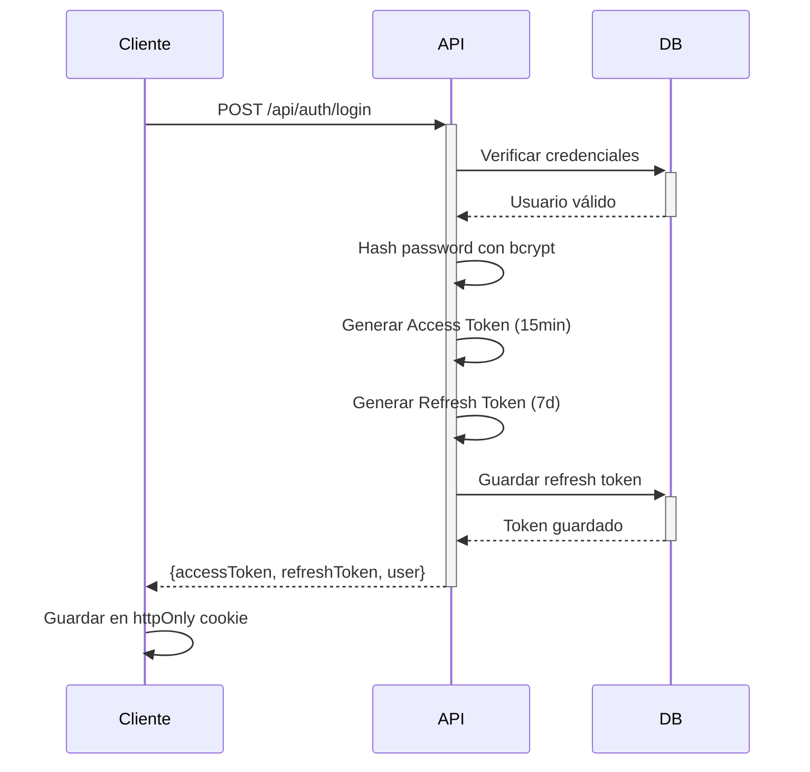

# 🔒 Arquitectura de Seguridad - VouTop

## 🎯 Objetivo
Implementar un sistema de seguridad de nivel empresarial con múltiples capas de protección.

---

## 📋 Estado Actual vs. Estado Deseado

| Característica | Actual | Objetivo |
|---------------|--------|----------|
| **Autenticación** | ❌ Simulada | ✅ JWT + Refresh Tokens |
| **Autorización** | ❌ Ninguna | ✅ RBAC (Role-Based Access Control) |
| **Rate Limiting** | ❌ No existe | ✅ Por IP + Por Usuario + Por Endpoint |
| **CORS** | ❌ No configurado | ✅ Whitelist configurado |
| **CSRF** | ❌ Vulnerable | ✅ SameSite + CSRF tokens |
| **Validación** | ⚠️ Básica | ✅ Zod schemas completos |
| **XSS Protection** | ⚠️ Básica | ✅ Sanitización + CSP headers |
| **SQL Injection** | ✅ Prisma protege | ✅ Mantener + auditoría |
| **Logging** | ⚠️ Console logs | ✅ Winston + rotación + alertas |
| **Monitoreo** | ❌ No existe | ✅ Métricas + dashboard |
| **Encriptación** | ❌ No existe | ✅ Bcrypt + Argon2 |
| **2FA** | ❌ No existe | ✅ TOTP (Google Authenticator) |

---

## 🏗️ Arquitectura de Seguridad

### Capa 1: Red y Firewall
```
┌─────────────────────────────────────────────┐
│  Cloudflare / WAF                           │
│  • DDoS Protection                          │
│  • Bot Detection                            │
│  • Rate Limiting (nivel red)                │
└─────────────────────────────────────────────┘
```

### Capa 2: Aplicación - Hooks Server
```
┌─────────────────────────────────────────────┐
│  hooks.server.ts                            │
│  ├── CORS Middleware                        │
│  ├── Security Headers                       │
│  ├── Rate Limiting (in-memory / Redis)      │
│  ├── JWT Verification                       │
│  ├── CSRF Protection                        │
│  └── Request Logging                        │
└─────────────────────────────────────────────┘
```

### Capa 3: Validación de Entrada
```
┌─────────────────────────────────────────────┐
│  Zod Schemas                                │
│  • Input sanitization                       │
│  • Type validation                          │
│  • Business rules                           │
└─────────────────────────────────────────────┘
```

### Capa 4: Autorización
```
┌─────────────────────────────────────────────┐
│  RBAC System                                │
│  • Roles: guest, user, premium, admin       │
│  • Permissions: read, create, update, delete│
│  • Resource ownership validation            │
└─────────────────────────────────────────────┘
```

### Capa 5: Base de Datos
```
┌─────────────────────────────────────────────┐
│  Prisma + PostgreSQL                        │
│  • Row-Level Security (RLS)                 │
│  • Audit logs                               │
│  • Encrypted sensitive fields               │
└─────────────────────────────────────────────┘
```

---

## 🔐 Sistema de Autenticación JWT

### Flujo de Login


### Tokens
- **Access Token**: JWT válido por 15 minutos
- **Refresh Token**: JWT válido por 7 días, rotable
- **Almacenamiento**: httpOnly cookies + SameSite=Strict

### Estructura del Access Token
```json
{
  "userId": 123,
  "username": "john_doe",
  "role": "user",
  "permissions": ["polls:read", "polls:create", "polls:vote"],
  "iat": 1234567890,
  "exp": 1234568790
}
```

---

## 🚦 Rate Limiting

### Estrategia Multi-Nivel

#### 1. Rate Limiting Global
```typescript
// Por IP
const GLOBAL_LIMITS = {
  windowMs: 15 * 60 * 1000, // 15 minutos
  max: 1000 // 1000 requests por ventana
}
```

#### 2. Rate Limiting por Endpoint
```typescript
const ENDPOINT_LIMITS = {
  '/api/auth/login': { max: 5, windowMs: 15 * 60 * 1000 }, // 5 intentos/15min
  '/api/polls/*/vote': { max: 100, windowMs: 60 * 60 * 1000 }, // 100 votos/hora
  '/api/polls': { max: 50, windowMs: 60 * 60 * 1000 }, // 50 creaciones/hora
  '/api/geocode': { max: 200, windowMs: 60 * 60 * 1000 } // 200 geocodes/hora
}
```

#### 3. Rate Limiting por Usuario
```typescript
// Usuarios autenticados tienen límites más altos
const USER_LIMITS = {
  guest: { max: 100, windowMs: 60 * 60 * 1000 },
  user: { max: 500, windowMs: 60 * 60 * 1000 },
  premium: { max: 2000, windowMs: 60 * 60 * 1000 },
  admin: { max: Infinity }
}
```

### Almacenamiento
- **Desarrollo**: In-memory (Map)
- **Producción**: Redis con TTL automático

---

## 🛡️ Protección CSRF

### Estrategia
1. **SameSite cookies**: `SameSite=Lax` para navegación, `Strict` para API
2. **Double Submit Cookie**: Token en cookie + header
3. **Origin/Referer validation**: Verificar origen de requests

### Implementación
```typescript
// En cada request mutante (POST, PUT, DELETE)
const csrfToken = request.headers.get('X-CSRF-Token')
const cookieToken = cookies.get('csrf-token')

if (csrfToken !== cookieToken) {
  throw error(403, 'CSRF token inválido')
}
```

---

## 📊 Sistema de Roles y Permisos

### Roles Definidos
```typescript
enum Role {
  GUEST = 'guest',       // Usuario sin registrar
  USER = 'user',         // Usuario registrado
  VERIFIED = 'verified', // Usuario con email verificado
  PREMIUM = 'premium',   // Usuario premium
  MODERATOR = 'moderator', // Moderador de contenido
  ADMIN = 'admin'        // Administrador
}
```

### Permisos por Rol

| Permiso | Guest | User | Verified | Premium | Moderator | Admin |
|---------|-------|------|----------|---------|-----------|-------|
| `polls:read` | ✅ | ✅ | ✅ | ✅ | ✅ | ✅ |
| `polls:vote` | ✅ | ✅ | ✅ | ✅ | ✅ | ✅ |
| `polls:create` | ❌ | ✅ | ✅ | ✅ | ✅ | ✅ |
| `polls:delete.own` | ❌ | ✅ | ✅ | ✅ | ✅ | ✅ |
| `polls:delete.any` | ❌ | ❌ | ❌ | ❌ | ✅ | ✅ |
| `users:ban` | ❌ | ❌ | ❌ | ❌ | ✅ | ✅ |
| `users:promote` | ❌ | ❌ | ❌ | ❌ | ❌ | ✅ |
| `analytics:view` | ❌ | ❌ | ❌ | ✅ | ✅ | ✅ |

### Límites por Rol

| Límite | Guest | User | Verified | Premium | Admin |
|--------|-------|------|----------|---------|-------|
| Votos/hora | 100 | 500 | 1000 | 5000 | ∞ |
| Encuestas/día | 0 | 5 | 20 | 100 | ∞ |
| Opciones/encuesta | - | 5 | 10 | 20 | ∞ |
| Duración máxima | - | 7d | 30d | 365d | ∞ |
| API rate limit | 100/h | 500/h | 1000/h | 5000/h | ∞ |

---

## 🧹 Sanitización y Validación

### Stack de Validación
```typescript
import { z } from 'zod'
import DOMPurify from 'isomorphic-dompurify'
import validator from 'validator'

// 1. Validación de schema
const pollSchema = z.object({
  title: z.string()
    .min(3, 'Mínimo 3 caracteres')
    .max(200, 'Máximo 200 caracteres')
    .transform(str => validator.escape(str)), // HTML escape
  
  description: z.string()
    .max(2000)
    .optional()
    .transform(str => str ? DOMPurify.sanitize(str) : undefined),
  
  category: z.enum(['politics', 'sports', 'tech', 'entertainment']),
  
  hashtags: z.array(z.string().regex(/^[a-zA-Z0-9_]+$/))
    .max(10, 'Máximo 10 hashtags'),
  
  options: z.array(z.object({
    optionLabel: z.string().min(1).max(100),
    color: z.string().regex(/^#[0-9A-Fa-f]{6}$/)
  })).min(2).max(10)
})

// 2. Uso en endpoint
export const POST: RequestHandler = async ({ request }) => {
  const rawData = await request.json()
  const validData = pollSchema.parse(rawData) // Lanza error si inválido
  // ... procesar validData
}
```

---

## 🔒 Headers de Seguridad

### Content Security Policy (CSP)
```typescript
const CSP = {
  'default-src': ["'self'"],
  'script-src': ["'self'", "'unsafe-inline'", 'cdn.jsdelivr.net'],
  'style-src': ["'self'", "'unsafe-inline'"],
  'img-src': ["'self'", 'data:', 'https:'],
  'font-src': ["'self'", 'data:'],
  'connect-src': ["'self'", 'api.ipapi.co'],
  'frame-ancestors': ["'none'"],
  'base-uri': ["'self'"],
  'form-action': ["'self'"]
}
```

### Otros Headers Críticos
```typescript
const securityHeaders = {
  'X-Frame-Options': 'DENY',
  'X-Content-Type-Options': 'nosniff',
  'X-XSS-Protection': '1; mode=block',
  'Referrer-Policy': 'strict-origin-when-cross-origin',
  'Permissions-Policy': 'geolocation=(self), microphone=(), camera=()',
  'Strict-Transport-Security': 'max-age=31536000; includeSubDomains; preload'
}
```

---

## 📝 Logging y Auditoría

### Eventos a Loggear
```typescript
enum SecurityEvent {
  // Autenticación
  LOGIN_SUCCESS = 'auth:login:success',
  LOGIN_FAILED = 'auth:login:failed',
  LOGOUT = 'auth:logout',
  TOKEN_REFRESH = 'auth:token:refresh',
  TOKEN_INVALID = 'auth:token:invalid',
  
  // Autorización
  PERMISSION_DENIED = 'authz:permission:denied',
  ROLE_CHANGE = 'authz:role:change',
  
  // Rate Limiting
  RATE_LIMIT_HIT = 'rate:limit:hit',
  RATE_LIMIT_BAN = 'rate:limit:ban',
  
  // Actividad sospechosa
  MULTIPLE_FAILED_LOGIN = 'security:suspicious:multiple_login_failed',
  UNUSUAL_LOCATION = 'security:suspicious:unusual_location',
  RAPID_VOTING = 'security:suspicious:rapid_voting',
  
  // Data modification
  POLL_CREATE = 'data:poll:create',
  POLL_DELETE = 'data:poll:delete',
  USER_BAN = 'data:user:ban'
}
```

### Estructura de Log
```typescript
interface SecurityLog {
  timestamp: Date
  event: SecurityEvent
  userId?: number
  ipAddress: string
  userAgent: string
  endpoint: string
  method: string
  statusCode: number
  responseTime: number
  metadata?: Record<string, any>
  severity: 'info' | 'warning' | 'error' | 'critical'
}
```

---

## 🚨 Sistema de Alertas

### Triggers de Alerta
1. **Más de 10 intentos de login fallidos** desde una IP en 10 minutos
2. **Rate limit excedido** más de 5 veces en 1 hora
3. **Token JWT inválido** repetidamente desde mismo usuario
4. **Cambio de ubicación sospechoso** (>500km en <1 hora)
5. **Votación masiva** (>50 votos en <5 minutos)
6. **Creación masiva de cuentas** desde misma IP
7. **Error 500** más de 10 veces en 5 minutos

### Canales de Notificación
- Discord webhook (alertas críticas)
- Email (resumen diario)
- Dashboard en tiempo real

---

## 🔐 Encriptación

### Passwords
```typescript
import bcrypt from 'bcrypt'
import argon2 from 'argon2'

// Usar Argon2 (más seguro que bcrypt)
const hash = await argon2.hash(password, {
  type: argon2.argon2id,
  memoryCost: 2 ** 16, // 64 MB
  timeCost: 3,
  parallelism: 1
})

const isValid = await argon2.verify(hash, password)
```

### Datos Sensibles en DB
```typescript
import crypto from 'crypto'

// Encriptar campos sensibles
function encrypt(text: string): string {
  const algorithm = 'aes-256-gcm'
  const key = Buffer.from(process.env.ENCRYPTION_KEY!, 'hex')
  const iv = crypto.randomBytes(16)
  
  const cipher = crypto.createCipheriv(algorithm, key, iv)
  let encrypted = cipher.update(text, 'utf8', 'hex')
  encrypted += cipher.final('hex')
  
  const authTag = cipher.getAuthTag()
  
  return `${iv.toString('hex')}:${authTag.toString('hex')}:${encrypted}`
}
```

---

## 🔑 2FA (Two-Factor Authentication)

### Implementación TOTP
```typescript
import speakeasy from 'speakeasy'
import qrcode from 'qrcode'

// Generar secret
const secret = speakeasy.generateSecret({
  name: 'VouTop',
  issuer: 'VouTop'
})

// Generar QR
const qrCodeUrl = await qrcode.toDataURL(secret.otpauth_url!)

// Verificar código
const isValid = speakeasy.totp.verify({
  secret: secret.base32,
  encoding: 'base32',
  token: userToken,
  window: 2 // Tolerancia de ±60 segundos
})
```

---

## 📦 Dependencias de Seguridad

```json
{
  "dependencies": {
    "@node-rs/argon2": "^1.8.0",
    "jose": "^5.2.0",
    "zod": "^3.22.4",
    "isomorphic-dompurify": "^2.9.0",
    "validator": "^13.11.0",
    "speakeasy": "^2.0.0",
    "qrcode": "^1.5.3"
  },
  "devDependencies": {
    "@types/validator": "^13.11.7",
    "@types/speakeasy": "^2.0.10"
  }
}
```

### Para Rate Limiting (elige uno)
- **Desarrollo**: In-memory (sin deps extra)
- **Producción pequeña**: `rate-limiter-flexible` con in-memory
- **Producción grande**: `rate-limiter-flexible` + Redis

---

## 🎯 Prioridades de Implementación

### Fase 1 (Crítico - Semana 1)
1. ✅ Sistema JWT completo
2. ✅ Rate limiting básico
3. ✅ CORS configurado
4. ✅ Validación con Zod
5. ✅ Security headers

### Fase 2 (Importante - Semana 2)
6. ✅ Sistema de roles y permisos
7. ✅ CSRF protection
8. ✅ Logging con Winston
9. ✅ Password hashing con Argon2
10. ✅ Input sanitization

### Fase 3 (Avanzado - Semana 3-4)
11. ⏳ 2FA con TOTP
12. ⏳ Dashboard de métricas
13. ⏳ Sistema de alertas
14. ⏳ Encriptación de campos sensibles
15. ⏳ Audit logs completos

### Fase 4 (Optimización - Ongoing)
16. ⏳ Redis para rate limiting
17. ⏳ WAF integration
18. ⏳ Penetration testing
19. ⏳ Security compliance (OWASP Top 10)
20. ⏳ Bug bounty program

---

## 📚 Referencias y Estándares

- **OWASP Top 10**: https://owasp.org/www-project-top-ten/
- **OWASP Cheat Sheets**: https://cheatsheetseries.owasp.org/
- **CWE Top 25**: https://cwe.mitre.org/top25/
- **NIST Guidelines**: https://www.nist.gov/cybersecurity
- **JWT Best Practices**: https://datatracker.ietf.org/doc/html/rfc8725

---

## ✅ Checklist de Seguridad

### Autenticación
- [ ] JWT con expiración corta (15min)
- [ ] Refresh tokens rotativos
- [ ] Password hashing con Argon2/Bcrypt
- [ ] Rate limiting en login (5 intentos/15min)
- [ ] Account lockout después de intentos fallidos
- [ ] 2FA opcional para usuarios

### Autorización
- [ ] RBAC implementado
- [ ] Permisos granulares
- [ ] Validación de ownership en recursos
- [ ] Principio de menor privilegio

### Data Protection
- [ ] HTTPS everywhere
- [ ] Cookies con httpOnly + Secure + SameSite
- [ ] Encriptación de datos sensibles
- [ ] No exponer PII en logs
- [ ] GDPR compliance

### Input Validation
- [ ] Zod schemas en todos los endpoints
- [ ] Sanitización HTML con DOMPurify
- [ ] Validación de tipos
- [ ] Límites de tamaño en payloads
- [ ] Whitelist de valores permitidos

### API Security
- [ ] CORS whitelist configurado
- [ ] Rate limiting por endpoint
- [ ] API versioning
- [ ] Error messages sin información sensible
- [ ] Request ID para tracking

### Infrastructure
- [ ] Security headers (CSP, X-Frame-Options, etc.)
- [ ] WAF configurado
- [ ] DDoS protection
- [ ] Firewall rules
- [ ] Regular security audits

### Monitoring
- [ ] Logging centralizado
- [ ] Alertas automatizadas
- [ ] Dashboard de métricas
- [ ] Incident response plan
- [ ] Regular log reviews

---

**Última actualización**: 2025-01-22  
**Versión**: 1.0  
**Mantenedor**: Equipo de Seguridad VouTop
